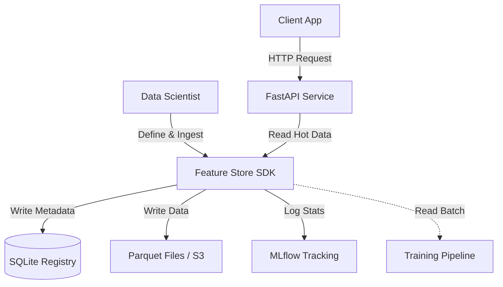

```markdown
# 🚀 Production-Grade Feature Store

[](https://github.com/harshithluc073/feature-store-v1/actions/workflows/ci.yml)


A **local-first, cloud-extensible** Feature Store for MLOps. It bridges the gap between local development and production serving by combining SQLite metadata management, Parquet storage, and automated data profiling into a cohesive system.

---

## 🏗 Architecture

The system operates on a "Local-First" principle, allowing data scientists to iterate rapidly without infrastructure overhead, while maintaining strict versioning and lineage suitable for production.



## ✨ Key Features

*   **📦 Automated Versioning:** Every ingestion creates a new immutable version (e.g., `v1`, `v2`) tracked in the registry.
*   **📊 Data Quality & Profiling:** Automatically calculates statistics (mean, nulls, distribution) during ingestion to detect drift.
*   **🕵️ Lineage Tracking:** Links raw data snapshots to feature definitions and owners.
*   **⚡ Low-Latency Serving:** Built-in **FastAPI** service for retrieving the latest feature values (Online Store).
*   **🧪 MLOps Integration:** Seamless integration with **MLflow** to log feature generation runs as experiments.
*   **🔄 CI/CD Ready:** Includes GitHub Actions pipeline for automated testing and validation.

---

## 🛠 Tech Stack

*   **Core Logic:** Python 3.9+, Pandas
*   **Metadata Registry:** SQLite (via SQLAlchemy)
*   **Storage Layer:** Local Parquet (Extensible to S3/GCS)
*   **Serving Layer:** FastAPI, Pydantic
*   **Observability:** MLflow

---

## 🚀 Quick Start

### 1. Installation

```bash
git clone https://github.com/harshithluc073/feature-store-v1.git
cd feature-store-v1
python -m venv venv
# On Windows:
.\venv\Scripts\activate
# On Mac/Linux:
source venv/bin/activate

pip install -r requirements.txt
pip install -e .
```

### 2. Complete Workflow Example

Create a python script or notebook to run the full lifecycle:

```python
from feature_store import FeatureStore
import pandas as pd

# Initialize
fs = FeatureStore()

# 1️⃣ Register a Feature
fs.register_feature(
    name="customer_weekly_spend",
    description="Total spend by customer over the last 7 days",
    owner="harshith"
)

# 2️⃣ Ingest Data (Automatically versions & profiles)
df = pd.DataFrame({
    "customer_id": [101, 102, 103],
    "spend": [150.50, 200.00, 0.0],
    "timestamp": pd.Timestamp.now()
})
fs.ingest_feature_data("customer_weekly_spend", df)

# 3️⃣ Offline Retrieval (For Model Training)
# Returns the latest version as a DataFrame
training_df = fs.get_feature_data("customer_weekly_spend")
print(training_df)

# 4️⃣ Online Retrieval (For Inference)
# Simulates low-latency lookup
latest_value = fs.get_online_value(
    feature_name="customer_weekly_spend", 
    entity_id=101, 
    entity_key="customer_id"
)
print(latest_value)
# Output: {'customer_id': 101, 'spend': 150.5, 'timestamp': ...}
```

---

## 🌐 Serving Features (REST API)

You can expose the Feature Store as a microservice using the built-in FastAPI app.

1.  **Start the Server:**
    ```bash
    uvicorn feature_store.api.main:app --reload
    ```

2.  **Make a Request:**
    *   **URL:** `http://127.0.0.1:8000/features/online`
    *   **Method:** `POST`
    *   **Body:**
        ```json
        {
          "feature_name": "customer_weekly_spend",
          "entity_id": 101,
          "entity_key": "customer_id"
        }
        ```

3.  **View Docs:**
    Go to `http://127.0.0.1:8000/docs` for the interactive Swagger UI.

---

## 📈 Viewing Experiment Logs (MLflow)

Every ingestion run is logged. To view lineage and statistics:

```bash
mlflow ui
```
Open `http://localhost:5000` in your browser.

---

## 📂 Project Structure

```text
feature-store-v1/
├── src/feature_store/
│   ├── core/
│   │   ├── registry/     # SQLite Database Models
│   │   ├── storage/      # I/O Abstraction (Parquet/S3)
│   │   ├── quality/      # Data Profiling & Drift
│   │   └── manager.py    # Main SDK Logic
│   ├── api/              # FastAPI Application
│   └── integrations/     # MLflow Hooks
├── tests/                # Pytest Suite
├── .github/workflows/    # CI/CD Configuration
└── requirements.txt
```

## 🔮 Future Roadmap

*   [ ] Add Redis support for high-concurrency Online Store.
*   [ ] Add S3/GCS support for Cloud Storage.
*   [ ] Implement Time-Travel joins (As-of joins).

## 📄 License

This project is licensed under the MIT License.
```